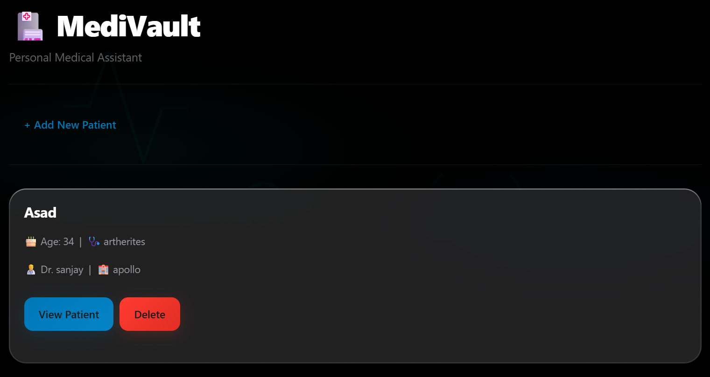
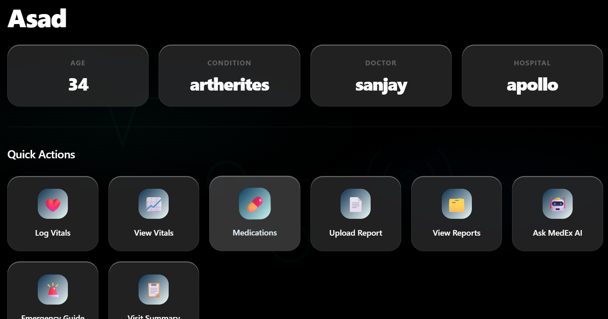
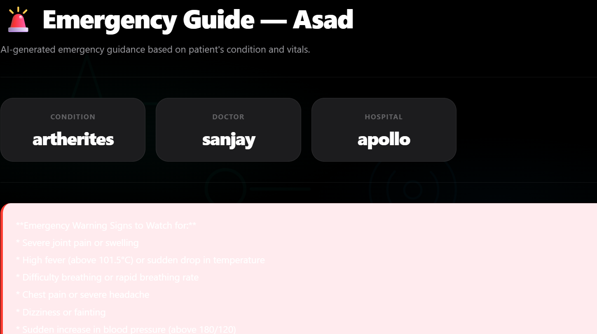

<div align="center">

# 🏥 MediVault AI

### A personal AI-powered medical assistant for patients and caregivers.

Store medical records, track vitals, manage medications, upload reports, and get intelligent health guidance — all in one place.

[](https://python.org)
[](https://flask.palletsprojects.com)
[](https://supabase.com)
[](https://groq.com)

</div>

---

## 💡 The Problem

Cancer patients and their families face three major struggles:

- **Information overload** — too many reports, too many medical terms they don't understand
- **Coordination chaos** — medications, vitals, and appointments all over the place
- **Anxiety between visits** — "Is this normal? What do I do right now?"

MediVault solves all three.

---

## 📸 Screenshots

### 🏠 Home — Patient List


### 📊 Patient Dashboard


### 🚨 Emergency Guide


---

## ✨ Features

### 🗂️ Patient Management
- Create and manage multiple patient profiles
- Store name, age, medical condition, doctor, and hospital

### ❤️ Vitals Tracker
- Log temperature, blood pressure, blood sugar, weight, and heart rate
- View full vitals history in a clean table
- Delete incorrect entries

### 💊 Medications
- Add medications with dose, frequency, and timing
- View complete medication schedule
- Delete discontinued medications

### 📄 Report Storage
- Upload PDFs and images directly to cloud storage
- Categorize reports (Blood Test, Imaging, Biopsy, Prescription, Doctor Notes)
- View and download any report anytime

### 🤖 MedEx AI Assistant
- Ask anything about the patient's health
- AI reads actual patient data — vitals, medications, condition
- Get dietary suggestions, explain vitals, and general health guidance

### 🚨 Emergency Guide
- AI-generated emergency warning signs based on patient's condition
- Immediate steps to take in an emergency
- When to call an ambulance

### 📋 Doctor Visit Summary
- AI generates a professional summary to show the doctor
- Includes vitals trend, medications, key concerns, and questions to ask
- Download as PDF

---

## 🏗️ Architecture

```
Browser / Mobile
       │
       ▼
  Flask Web App (app.py)
       │
       ├──► database.py (psycopg2)
       │         │
       │         ▼
       │    Supabase PostgreSQL
       │    (patients, vitals, medications, reports tables)
       │
       ├──► Supabase Storage
       │    (PDF and image uploads)
       │
       └──► Groq API (LLaMA 3.3 70B)
            (MedEx AI, Emergency Guide, Visit Summary, PDF export)
```

---

## 🛠️ Tech Stack

| Layer | Technology |
|---|---|
| Language | Python 3.12 |
| Web Framework | Flask |
| Database | PostgreSQL via Supabase |
| File Storage | Supabase Storage |
| AI | Groq API — LLaMA 3.3 70B |
| PDF Generation | ReportLab |
| DB Driver | psycopg2 |
| Secrets | python-dotenv |

---

## ⚙️ Setup Instructions

### Prerequisites
- Python 3.10+
- A free [Supabase](https://supabase.com) account
- A free [Groq](https://console.groq.com) API key

### 1. Clone the repository
```bash
git clone https://github.com/Taha-Mohii/MediVault-AI.git
cd MediVault-AI
```

### 2. Create a virtual environment
```bash
python -m venv .venv
.venv\Scripts\activate       # Windows
source .venv/bin/activate    # Mac/Linux
```

### 3. Install dependencies
```bash
pip install -r requirements.txt
```

### 4. Set up environment variables
Create a `.env` file in the root folder:
```env
DATABASE_URL=your_supabase_connection_string
SUPABASE_URL=https://your-project.supabase.co
SUPABASE_KEY=your_supabase_anon_key
GROQ_API_KEY=your_groq_api_key
```

### 5. Set up Supabase database
Run this SQL in your Supabase SQL Editor:

```sql
CREATE TABLE patients (
    id SERIAL PRIMARY KEY,
    name TEXT NOT NULL,
    age INTEGER,
    condition TEXT,
    doctor TEXT,
    hospital TEXT,
    created_at TIMESTAMP DEFAULT NOW()
);

CREATE TABLE vitals (
    id SERIAL PRIMARY KEY,
    patient_id INTEGER REFERENCES patients(id),
    date TEXT,
    temperature REAL,
    bp_systolic INTEGER,
    bp_diastolic INTEGER,
    sugar REAL,
    weight REAL,
    heart_rate REAL
);

CREATE TABLE medications (
    id SERIAL PRIMARY KEY,
    patient_id INTEGER REFERENCES patients(id),
    name TEXT,
    dose TEXT,
    frequency TEXT,
    timing TEXT
);

CREATE TABLE reports (
    id SERIAL PRIMARY KEY,
    patient_id INTEGER REFERENCES patients(id),
    filename TEXT,
    category TEXT,
    file_url TEXT,
    uploaded_at TIMESTAMP DEFAULT NOW()
);
```

### 6. Create a Supabase Storage bucket
- Go to Supabase → Storage → New Bucket
- Name it `Reports`
- Make it public

### 7. Run the app
```bash
python app.py
```

Open `http://localhost:5000` in your browser.

---

## 📁 Project Structure

```
MediVault-AI/
│
├── app.py                  # Flask routes and application logic
├── database.py             # All database and storage functions
├── requirements.txt        # Python dependencies
│
├── static/
│   └── style.css           # Professional medical UI design
│
├── templates/
│   ├── index.html          # Patient list
│   ├── add.html            # Add patient form
│   ├── patient.html        # Patient dashboard
│   ├── add_vitals.html     # Log vitals form
│   ├── vitals.html         # Vitals history
│   ├── add_medication.html # Add medication form
│   ├── medication.html     # Medication list
│   ├── upload.html         # Upload report form
│   ├── reports.html        # Reports list
│   ├── ai.html             # MedEx AI chat
│   ├── emergency.html      # Emergency guide
│   └── summary.html        # Doctor visit summary
│
├── screenshots/            # App screenshots
├── .env                    # Secret keys — never pushed to GitHub
└── .gitignore
```

---

## 🔒 Security

- All API keys and credentials stored in `.env`
- `.env` excluded from version control via `.gitignore`
- Supabase handles secure file storage
- No sensitive patient data pushed to GitHub

---

## ⚠️ Disclaimer

MediVault AI is not a substitute for professional medical advice, diagnosis, or treatment. Always consult a qualified doctor for medical decisions. The AI guidance provided is for informational purposes only.

---

## 🗺️ Roadmap

- [ ] Appointment tracker with reminders
- [ ] Abnormal vitals alerts
- [ ] Multi-language support
- [ ] Symptom diary
- [ ] Full PDF export of patient history

---

## 👤 Author

**Taha Mohii** — CS Student, graduating 2028

[](https://github.com/Taha-Mohii)

---

<div align="center">

⭐ If you found this useful, consider starring the repo!

*Built with purpose — to help patients and caregivers navigate the overwhelming experience of medical treatment.*

</div>
